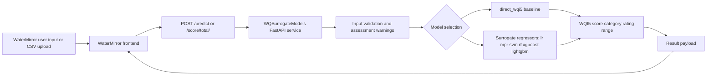

# WQSurrogateModels

[](LICENSE)
[](https://www.python.org)
[](https://github.com/KageRyo/WQSurrogateModels/actions/workflows/ci.yml)

`WQSurrogateModels` is the backend and model repository for `WaterMirror`.

It supports `WQI5-based current-state water quality assessment`, not future forecasting. The committed dataset does not contain timestamps, so this project must be described as `cross-sectional surrogate regression` and `current-state assessment`.

## What This Repository Does

- serves a FastAPI backend for WQI5 assessment
- supports a `direct_wqi5` formula baseline
- supports surrogate regression models: `lr`, `mpr`, `svm`, `rf`, `xgboost`, `lightgbm`
- provides reproducibility scripts and experiment configuration
- keeps compatibility with the legacy CSV upload endpoint used by `WaterMirror`

## Architecture



## Data Flow

1. WaterMirror or another client submits five current-state indicators.
2. The backend validates the payload and selects either `direct_wqi5` or a surrogate regressor.
3. The service returns `score`, `category`, `rating_range`, `assessment`, and `warnings`.
4. The frontend displays the assessment result without recalculating category thresholds locally.

## Design Rationale

- `direct_wqi5` provides an explicit non-ML baseline for reviewer-facing comparisons.
- Surrogate regressors are retained to study speed/accuracy trade-offs and deployment flexibility.
- The repository intentionally frames the task as present-state assessment because the committed dataset does not retain timestamps.

## Environment

Copy `.env.example` to `.env` and adjust values if needed.

```bash
cp .env.example .env
```

Key variables:

- `MODEL_DIR=models`
- `DEFAULT_MODEL=direct_wqi5`
- `API_HOST=0.0.0.0`
- `API_PORT=8001`

## Install

```bash
pip install .
```

For development and tests:

```bash
pip install -e ".[dev]"
```

To also enable the full set of surrogate models (`xgboost`, `lightgbm`):

```bash
pip install -e ".[dev,models]"
```

## Run

```bash
python main.py
```

## API

### `POST /predict`

```json
{
  "DO": 7.2,
  "BOD": 2.1,
  "NH3N": 0.3,
  "EC": 450,
  "SS": 12,
  "model_type": "lightgbm"
}
```

Response:

```json
{
  "score": 82.5,
  "category": "Good",
  "rating_range": "70 < WQI5 ≤ 85",
  "model_type": "lightgbm",
  "latency_ms": 12.4,
  "assessment": {
    "DO": "Good",
    "BOD": "Fair",
    "NH3N": "Fair",
    "EC": "Fair",
    "SS": "Fair"
  },
  "warnings": []
}
```

### Other endpoints

- `GET /status`
- `GET /models`
- `GET /percentile?score=82.5`
- `GET /categories`
- `POST /score/total/` for legacy CSV mean-score compatibility
- `POST /score/all/` for legacy CSV per-row scores

## Reproducibility

Run:

```bash
pip install -e ".[dev]"
python scripts/reproduce_results.py --config configs/experiment_config.yaml --output-dir results_verification
```

Outputs are written to the configured output directory.

If you use the local `WQI` conda environment and want to run the full experiment (all models including xgboost/lightgbm):

```bash
conda activate WQI
pip install -e ".[models]"
python scripts/reproduce_results.py --config configs/experiment_config.yaml --output-dir results_verification
```

To protect archived manuscript outputs, the script now refuses to overwrite an existing results directory unless `--overwrite` is passed explicitly.

### Reproducibility Hyperparameters

| Model | Library | Preprocessing | Key Hyperparameters |
| --- | --- | --- | --- |
| `direct_wqi5` | formula baseline | none | direct WQI5 equation |
| `lr` | scikit-learn | mean imputation + standard scaling | default `LinearRegression()` |
| `mpr` | scikit-learn | mean imputation + polynomial features + standard scaling | `degree=2`, `include_bias=False` |
| `svm` | scikit-learn | mean imputation + standard scaling | `kernel=rbf`, `C=10.0`, `epsilon=0.1` |
| `rf` | scikit-learn | mean imputation | `n_estimators=300`, `random_state=0`, `n_jobs=-1` |
| `xgboost` | xgboost | mean imputation | `n_estimators=300`, `max_depth=6`, `learning_rate=0.05`, `subsample=0.9`, `colsample_bytree=0.9`, `random_state=0` |
| `lightgbm` | lightgbm | mean imputation | `n_estimators=300`, `learning_rate=0.05`, `random_state=0` |

Repeated validation uses stratified random splits over WQI5 categories with seeds `0, 1, 2, 3, 4`.

Supporting documentation:

- [docs/data_preparation.md](/mnt/8tb_hdd/ryo/WQSurrogateModels/docs/data_preparation.md)
- [docs/experiment_protocol.md](/mnt/8tb_hdd/ryo/WQSurrogateModels/docs/experiment_protocol.md)

## Project Structure

- `data/`: processed datasets and subsets
- `models/`: persisted surrogate model artifacts
- `src/`: API and reusable backend logic
- `scripts/`: reproducibility runners
- `configs/`: experiment settings
- `tests/`: pytest suite

## Limitations

- no timestamp column is available in the committed dataset
- no claim of temporal forecasting should be made
- direct raw-data provenance from the upstream `87,005` records still needs a versioned audit trail in the repo
- optional dependencies such as `xgboost` and `lightgbm` must exist in the runtime environment to retrain those models

## License

Apache License 2.0. See `LICENSE`.
