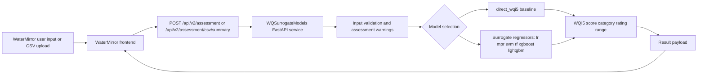

# WQSurrogateModels

[](LICENSE)
[](https://www.python.org)
[](https://github.com/KageRyo/WQSurrogateModels/actions/workflows/ci.yml)

WQSurrogateModels is a FastAPI backend for WQI5-based water quality assessment. It provides a direct WQI5 formula baseline, surrogate regression models, API endpoints, and scripts for reproducing the experiments.

> Scope: this repository assesses current water quality state from five physicochemical indicators.
> It does not perform temporal forecasting because the committed dataset does not contain timestamps.

It provides:

- a `direct_wqi5` baseline
- surrogate regression models
- `/api/v2/*` endpoints for WaterMirror and other HTTP clients
- reproducibility scripts and experiment documentation

## Relationship with the Companion Repository

This project is part of a two-repository system:

- `WaterMirror`: cross-platform mobile frontend for data entry, CSV upload, and result visualization
- `WQSurrogateModels`: FastAPI backend and reproducibility repository for WQI5-based current-state water quality assessment

WaterMirror depends on the API contract exposed by this repository. `WQSurrogateModels` can also be used independently through `curl`, Postman, or custom scripts.

## What This Repository Does

- serves a FastAPI backend for WQI5 assessment
- supports a `direct_wqi5` formula baseline
- supports surrogate regression models: `lr`, `mpr`, `svm`, `rf`, `xgboost`, `lightgbm`
- provides reproducibility scripts and experiment configuration
- keeps compatibility with legacy endpoints while treating `/api/v2/*` as the primary contract

## Terminology

- `direct_wqi5`: computes the WQI5 score directly from the documented formula.
- `surrogate model`: a regression model trained to approximate WQI5 scores from the same five indicators.
- `complete-input model`: a model that requires all five indicators: `DO`, `BOD`, `NH3N`, `EC`, and `SS`.
- `missing-indicator experiment`: an experiment that evaluates model behavior when one or more indicators are unavailable. The committed complete-input artifacts are not incomplete-input models.
- `107-window stress test`: a repository-specific synthetic perturbation analysis over consecutive external hold-out windows. It is not a new validation method and should not be called cross-validation.

## Architecture



## Environment

Copy `.env.example` to `.env` and adjust values if needed.

```bash
cp .env.example .env
```

Key variables:

- `MODEL_DIR=models`
- `DEFAULT_MODEL=direct_wqi5`
- `API_HOST=0.0.0.0`
- `API_PORT=8001`
- `AUTO_PORT=false`

## Install

```bash
pip install .
```

For development and tests:

```bash
pip install -e ".[dev]"
```

Local or externally provided scikit-learn surrogate artifacts should be loaded
with the compatible scikit-learn version used during export. Model binaries are
not committed to Git; see `models/production_model_manifest.json`
for the expected local paths.

To also enable the full set of surrogate models (`xgboost`, `lightgbm`):

```bash
pip install -e ".[dev,models]"
```

## Local Inference Artifacts

Model binaries are local artifacts and are not committed to Git. The current
model package exports one complete-input API artifact for each surrogate model:

```text
models/LightGBM/modelLGBMVer.2.0-50000-seed0.pkl
models/LR/modelLRVer.2.0-50000-seed0.pkl
models/MPR/modelMPRVer.2.0-50000-seed3.pkl
models/RF/modelRFVer.2.0-50000-seed0.pkl
models/SVM/modelSVMVer.2.0-50000-seed3.pkl
models/XGBoost/modelXGBVer.2.0-50000-seed2.pkl
```

The committed model artifact manifest is:

```text
models/production_model_manifest.json
```

The manifest filename is retained for compatibility with existing scripts. In
this documentation, it refers to local inference artifacts, not evidence of a
formally validated deployment.

Each artifact is extracted from the complete-input `full_reference`
result with the lowest external `10,714`-row hold-out MAE for that model type.
These artifacts remain complete-input WQI5 surrogates and require:

```text
DO, BOD, NH3N, EC, SS
```

They should not be interpreted as models for incomplete-input cases. Legacy
API artifacts are kept locally under `models/archive/legacy_v1/` for
traceability. Experiment bundles remain under ignored `results_*` folders.

## Run

```bash
python main.py
```

If `API_PORT` is already occupied, the default behavior is to fail fast with a clearer error message. For local development, you can opt in to automatic fallback ports:

```env
AUTO_PORT=true
```

With `AUTO_PORT=true`, the server tries `API_PORT` first and then scans upward (`8002`, `8003`, ...) until it finds a free port.

## API

Primary endpoints live under `/api/v2/*`.

### Quick example

`POST /api/v2/assessment`

```json
{ "DO": 7.2, "BOD": 2.1, "NH3N": 0.3, "EC": 450, "SS": 12, "model_type": "lightgbm" }
```

Legacy compatibility endpoints such as `POST /predict`, `POST /score/total/`, and `GET /status` are retained but deprecated.

## Documentation

User and API:

- [API Reference](docs/api-reference.md)
- [Full-Stack Local Run](docs/fullstack-local-run.md)
- [WaterMirror Integration](docs/watermirror-integration.md)

Methodology:

- [WQI5 Formula](docs/wqi5-formula.md)
- [Data Preparation](docs/data_preparation.md)
- [Metrics](docs/metrics.md)
- [Model Hyperparameters](docs/model-hyperparameters.md)
- [Model Card](docs/model_card.md)
- [Limitations](docs/limitations.md)

Experiments and statistics:

- [Revised Experiment Protocol](docs/experiment_protocol.md)
- [Sample-Size Experiments](docs/sample-size-experiments.md)
- [Missing-Indicator Experiments](docs/missing-indicator-robustness-experiments.md)
- [Statistical Analysis](docs/statistical-analysis.md)
- [Statistics Output Guide](statistics/README.md)

Archive:

- [Legacy Benchmark Protocol](docs/original-benchmark-protocol.md)
- [Earlier Missing-Indicator Core Experiments](docs/missing-indicator-core-experiments.md)

## Reproducibility

Run:

```bash
pip install -e ".[dev]"
python scripts/reproduce_results.py --config configs/experiment_config.yaml --output-dir results/verification_run
```

If you use the local `WQI` conda environment and want to run the full experiment (all models including xgboost/lightgbm):

```bash
conda activate WQI
pip install -e ".[models]"
python scripts/reproduce_results.py --config configs/experiment_config.yaml --output-dir results/verification_run
```

To protect archived result outputs, the script now refuses to overwrite an existing results directory unless `--overwrite` is passed explicitly.

Run the missing-indicator core experiments:

```bash
python scripts/run_missing_indicator_experiments.py \
  --config configs/missing_indicator_config.yaml \
  --output-dir results/missing_indicator_core_run \
  --compute-device gpu \
  --gpu-id 0
```

This workflow saves model artifacts, internal-test predictions, external
`10,714`-row inference predictions, summary metrics, confidence intervals,
paired tests, and stress-scenario summaries into the selected output directory.

Run the missing-indicator workflow with single-indicator missing settings,
event-window stress testing, the 107-window stress test, and CPU-only timing
support:

```bash
python scripts/run_missing_indicator_robustness_experiments.py \
  --config configs/missing_indicator_robustness_config.yaml \
  --output-dir results/missing_indicator_robustness_run

python scripts/measure_missing_indicator_cpu_timing.py \
  --output-dir results/missing_indicator_robustness_run

python scripts/run_stress107_event_windows.py \
  --artifact-dir results/missing_indicator_robustness_run \
  --output-dir results/stress107_run

python scripts/export_missing_indicator_robustness_excel.py \
  --output-dir results/stress107_run
```

The 107-window stress test divides the external `10,714`-row hold-out into
`107` consecutive event windows and applies 30%, 100%, and 300% synthetic
perturbations. The `stress107` filename prefix is repository-specific. It should
not be described as `107-fold cross-validation`; these are event locations, not
training-validation folds.

Prepare result tables and local inference artifacts from the
organized result bundle:

```bash
python scripts/prepare_statistics_outputs.py \
  --bundle-dir results/manuscript_package \
  --complete-input-gpu-dir results/complete_input_gpu \
  --output-dir statistics/outputs \
  --update-production-model \
  --archive-legacy-50000-artifacts
```

The `--update-production-model` flag name is retained for script compatibility.
It updates local inference artifacts and the model artifact manifest.

Result-table outputs are written to:

- `statistics/outputs/complete_input_performance.csv`
- `statistics/outputs/missing_indicator_robustness.csv`
- `statistics/outputs/cpu_only_timing.csv`
- `statistics/outputs/stress107_summary.csv`
- `statistics/outputs/bootstrap_ci.csv`
- `statistics/outputs/paired_error_tests.csv`
- `statistics/outputs/sample_size_sensitivity.csv`
- `statistics/outputs/sample_size_metrics_by_fold.csv`

GPU and multicore CPU acceleration may be used to reproduce the
model-comparison experiments. CPU-only timing is reported separately as a rough
inference-time reference for constrained CPU environments.

Prepare the sample-size result tables from the consolidated local
sample-size run:

```bash
python scripts/prepare_sample_size_outputs.py \
  --metrics-dir results/sample_size_experiments/metrics \
  --output-dir statistics/outputs
```

### Local Result Archive

Large experiment outputs are organized under `results/` and are not committed
to Git. The current local layout is:

- `results/complete_input_cpu/`: complete-input repeated validation on CPU.
- `results/complete_input_gpu/`: complete-input repeated validation with GPU
  acceleration for supported models.
- `results/reduced_indicator_cpu/`: reduced-indicator experiment on CPU.
- `results/reduced_indicator_gpu/`: reduced-indicator experiment with GPU
  acceleration for supported models.
- `results/missing_indicator_core/`: core missing-indicator experiment with
  saved models, predictions, metrics, confidence intervals, paired tests, and
  stress summaries.
- `results/missing_indicator_robustness/`: single-indicator and combined
  missing-indicator robustness results, including CPU-only timing outputs.
- `results/stress107/`: 107 sequential event-window stress-test outputs.
- `results/manuscript_package/`: organized CSV files and Excel workbooks for
  result tables and discussion.
- `results/sample_size_experiments/`: consolidated `1,000`, `5,000`, `10,000`,
  and `50,000` row sample-size experiment outputs.

Model binaries under `models/*/*.pkl` are also local artifacts and are not
committed. `models/production_model_manifest.json` records the expected local
paths and source experiment artifacts for the six supported model families.

### Reproducibility Hyperparameters

The table below describes the current reproducibility workflow. Archived exploratory scripts may use `GridSearchCV` and library defaults; see [docs/original-benchmark-protocol.md](docs/original-benchmark-protocol.md).

| Model | Library | Preprocessing | Key Hyperparameters |
| --- | --- | --- | --- |
| `direct_wqi5` | formula baseline | none | direct WQI5 equation |
| `lr` | scikit-learn | mean imputation + standard scaling | default `LinearRegression()` |
| `mpr` | scikit-learn | mean imputation + polynomial features + standard scaling | `degree=2`, `include_bias=False` |
| `svm` | scikit-learn | mean imputation + standard scaling | `kernel=rbf`, `C=10.0`, `epsilon=0.1` |
| `rf` | scikit-learn | mean imputation | `n_estimators=300`, `random_state=0`, `n_jobs=-1` |
| `xgboost` | xgboost | mean imputation | `n_estimators=300`, `max_depth=6`, `learning_rate=0.05`, `subsample=0.9`, `colsample_bytree=0.9`, `random_state=0` |
| `lightgbm` | lightgbm | mean imputation | `n_estimators=300`, `learning_rate=0.05`, `random_state=0` |

Repeated validation uses stratified random splits over WQI5 categories with seeds `0, 1, 2, 3, 4`.

## Project Structure

- `data/`: processed datasets and subsets
- `models/`: local inference manifest and artifact paths; model binaries are not committed
- `src/`: API and reusable backend logic
- `scripts/`: reproducibility runners
- `archive/legacy_training/`: archived exploratory training scripts from the
  older `src/training` layout
- `configs/`: experiment settings
- `tests/`: pytest suite

## License

Apache License 2.0. See `LICENSE`.
