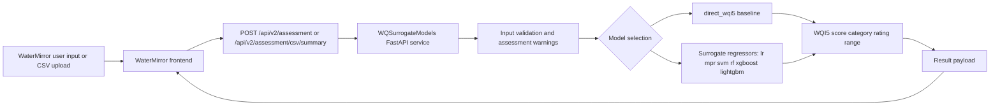

# WQSurrogateModels

[](LICENSE)
[](https://www.python.org)
[](https://github.com/KageRyo/WQSurrogateModels/actions/workflows/ci.yml)

WQSurrogateModels is a FastAPI backend and reproducibility repository for WQI5-based current-state water quality assessment.

> Scope: this repository performs WQI5-based current-state water quality assessment.
> It does not perform temporal forecasting because the committed dataset does not contain timestamps.

It provides:

- a `direct_wqi5` baseline
- surrogate regression models
- `/api/v2/*` endpoints for WaterMirror and other HTTP clients
- reproducibility scripts and experiment documentation

## Relationship with the Companion Repository

This project is part of a two-repository system:

- `WaterMirror`: cross-platform mobile frontend for data entry, CSV upload, and result visualization
- `WQSurrogateModels`: FastAPI backend and model/reproducibility repository for WQI5-based current-state water quality assessment

WaterMirror depends on the API contract exposed by this repository. `WQSurrogateModels` can also be used independently through `curl`, Postman, or custom scripts.

## What This Repository Does

- serves a FastAPI backend for WQI5 assessment
- supports a `direct_wqi5` formula baseline
- supports surrogate regression models: `lr`, `mpr`, `svm`, `rf`, `xgboost`, `lightgbm`
- provides reproducibility scripts and experiment configuration
- keeps compatibility with legacy endpoints while treating `/api/v2/*` as the primary contract

## Architecture



## Environment

Copy `.env.example` to `.env` and adjust values if needed.

```bash
cp .env.example .env
```

Key variables:

- `MODEL_DIR=models`
- `DEFAULT_MODEL=direct_wqi5`
- `API_HOST=0.0.0.0`
- `API_PORT=8001`
- `AUTO_PORT=false`

## Install

```bash
pip install .
```

For development and tests:

```bash
pip install -e ".[dev]"
```

The committed scikit-learn surrogate artifacts in `models/` were serialized with `scikit-learn 1.5.2`. Use that same version when loading them, or retrain and re-export the artifacts in your target version.

To also enable the full set of surrogate models (`xgboost`, `lightgbm`):

```bash
pip install -e ".[dev,models]"
```

## Run

```bash
python main.py
```

If `API_PORT` is already occupied, the default behavior is to fail fast with a clearer error message. For local development, you can opt in to automatic fallback ports:

```env
AUTO_PORT=true
```

With `AUTO_PORT=true`, the server tries `API_PORT` first and then scans upward (`8002`, `8003`, ...) until it finds a free port.

## API

Primary endpoints live under `/api/v2/*`.

### Quick example

`POST /api/v2/assessment`

```json
{ "DO": 7.2, "BOD": 2.1, "NH3N": 0.3, "EC": 450, "SS": 12, "model_type": "lightgbm" }
```

Legacy compatibility endpoints such as `POST /predict`, `POST /score/total/`, and `GET /status` are retained but deprecated.

## Documentation

- [WaterMirror Integration](docs/watermirror-integration.md)
- [API Reference](docs/api-reference.md)
- [Full-Stack Local Run](docs/fullstack-local-run.md)
- [WQI5 Formula](docs/wqi5-formula.md)
- [Metrics](docs/metrics.md)
- [Data Preparation](docs/data_preparation.md)
- [Original Benchmark Protocol](docs/original-benchmark-protocol.md)
- [Revised Experiment Protocol](docs/experiment_protocol.md)
- [Statistical Analysis](docs/statistical-analysis.md)
- [Model Hyperparameters](docs/model-hyperparameters.md)
- [Model Card](docs/model_card.md)
- [Limitations](docs/limitations.md)

## Reproducibility

Run:

```bash
pip install -e ".[dev]"
python scripts/reproduce_results.py --config configs/experiment_config.yaml --output-dir results_verification
```

If you use the local `WQI` conda environment and want to run the full experiment (all models including xgboost/lightgbm):

```bash
conda activate WQI
pip install -e ".[models]"
python scripts/reproduce_results.py --config configs/experiment_config.yaml --output-dir results_verification
```

To protect archived manuscript outputs, the script now refuses to overwrite an existing results directory unless `--overwrite` is passed explicitly.

### Reproducibility Hyperparameters

The table below describes the revised reproducibility workflow. Archived exploratory scripts may use `GridSearchCV` and library defaults; see [docs/original-benchmark-protocol.md](docs/original-benchmark-protocol.md).

| Model | Library | Preprocessing | Key Hyperparameters |
| --- | --- | --- | --- |
| `direct_wqi5` | formula baseline | none | direct WQI5 equation |
| `lr` | scikit-learn | mean imputation + standard scaling | default `LinearRegression()` |
| `mpr` | scikit-learn | mean imputation + polynomial features + standard scaling | `degree=2`, `include_bias=False` |
| `svm` | scikit-learn | mean imputation + standard scaling | `kernel=rbf`, `C=10.0`, `epsilon=0.1` |
| `rf` | scikit-learn | mean imputation | `n_estimators=300`, `random_state=0`, `n_jobs=-1` |
| `xgboost` | xgboost | mean imputation | `n_estimators=300`, `max_depth=6`, `learning_rate=0.05`, `subsample=0.9`, `colsample_bytree=0.9`, `random_state=0` |
| `lightgbm` | lightgbm | mean imputation | `n_estimators=300`, `learning_rate=0.05`, `random_state=0` |

Repeated validation uses stratified random splits over WQI5 categories with seeds `0, 1, 2, 3, 4`.

## Project Structure

- `data/`: processed datasets and subsets
- `models/`: persisted surrogate model artifacts
- `src/`: API and reusable backend logic
- `scripts/`: reproducibility runners
- `configs/`: experiment settings
- `tests/`: pytest suite

## License

Apache License 2.0. See `LICENSE`.
