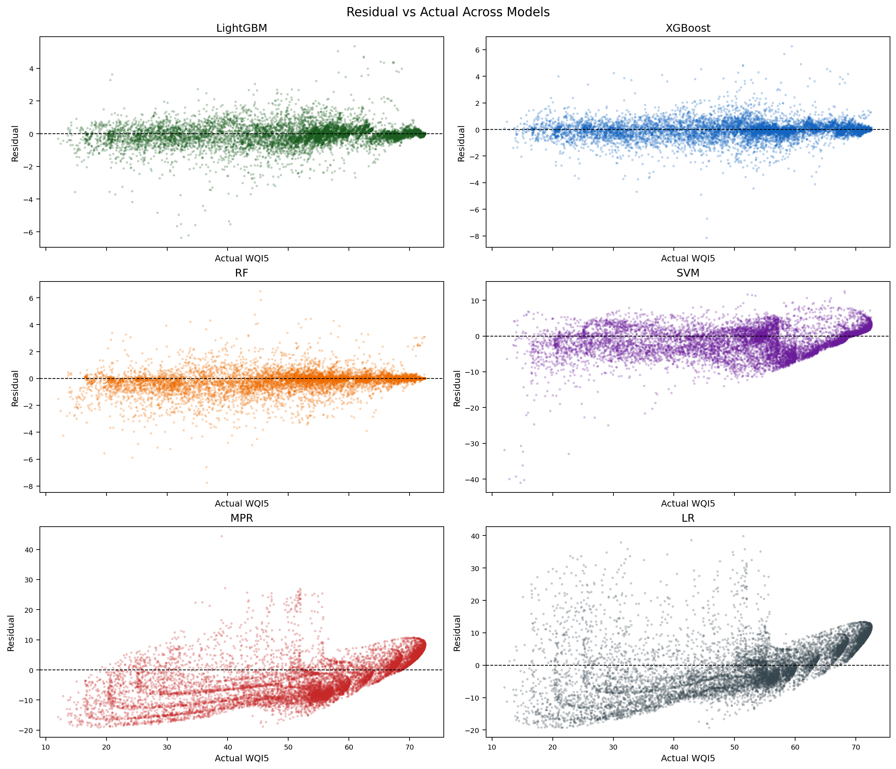
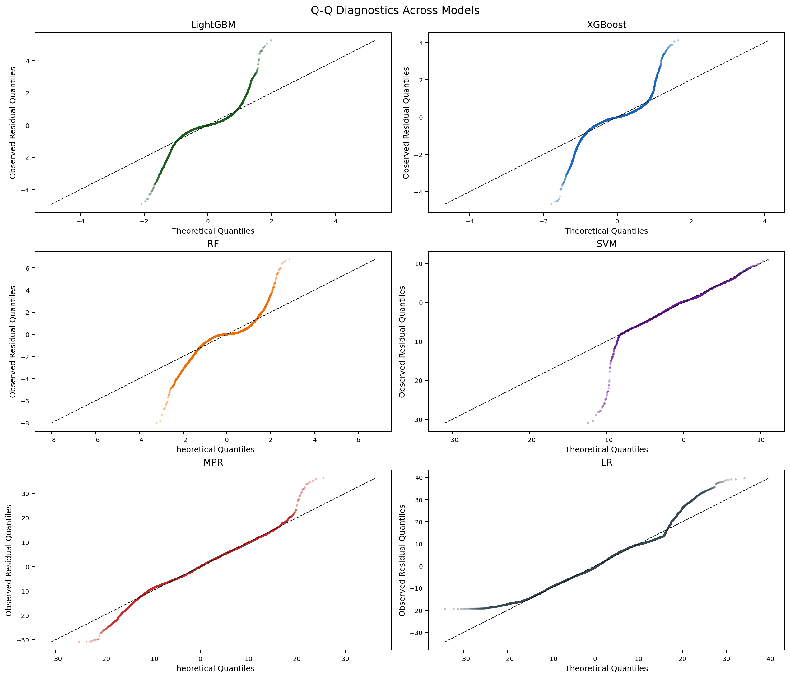

# Statistical Analysis

This document summarizes the statistical checks used for the WQI5 surrogate-regression results.

## Interpretation Boundaries

This analysis evaluates WQI5 surrogate-regression performance. The target score is computed from the same five indicators used as model inputs, so the results should be interpreted as WQI5 approximation and deployment-oriented model benchmarking, not as future water-quality forecasting.

Bootstrap intervals quantify uncertainty on the available inference evaluation rows. They do not remove possible temporal or spatial autocorrelation in the original environmental measurements.

## Feature-Score Correlation

Pearson and Spearman correlation coefficients can be computed between each raw water-quality indicator and the calculated WQI5 `Score`:

- `DO` vs `Score`
- `BOD` vs `Score`
- `NH3N` vs `Score`
- `EC` vs `Score`
- `SS` vs `Score`

Because `Score` is constructed from the same five indicators, this analysis is descriptive. It summarizes feature-index relationships in the processed dataset.

## Model Reliability Analysis

Model reliability is evaluated on inference prediction outputs using:

- `R²`
- `MAE`
- `RMSE`
- `NMAE`
- `Mean Predictive Accuracy (MPA)`
- `Residual Mean`
- `Residual Std.`

Residuals are defined as:

```text
residual_i = y_i - ŷ_i
```

where `y_i` is the reference WQI5 score and `ŷ_i` is the model-estimated WQI5 score.

## Statistical Coverage

The statistics workflow covers three analysis families:

### Confidence Intervals

Two confidence-interval estimates are used because the data are available at two levels:

- run-level `95%` intervals for repeated subset-benchmark logs
- row-level bootstrap `95%` intervals for the `10714` prediction records

Covered metrics include:

- `R²`
- `MAE`
- `RMSE`
- `Mean Predictive Accuracy (MPA)`

The row-level bootstrap intervals cover the continuous regression metrics listed above.

### Interval Definitions

Run-level intervals in `metric_ci_by_runs.csv` summarize repeated benchmark runs. For each `sample_size`, `model`, and metric:

```text
mean +/- t_(0.975, n-1) * sample_std / sqrt(n)
```

These intervals describe variation across repeated runs. When only one run is available, only the point estimate is shown.

Inference-evaluation metric intervals in `test_bootstrap_ci.csv` summarize prediction performance on the `10714` evaluation rows. Rows are resampled with replacement for each model, metrics are recomputed for each bootstrap sample, and the 2.5th and 97.5th percentiles are reported.

Paired-difference intervals in `paired_tests_by_runs.csv` and `test_paired_error_tests.csv` summarize model-to-model differences. For inference-evaluation error comparisons, the paired difference is:

```text
diff_i = |y_i - yhat_A_i| - |y_i - yhat_B_i|
```

The paired-difference interval is obtained by bootstrapping the paired differences and taking the 2.5th and 97.5th percentiles of the bootstrap mean differences. Intervals crossing zero indicate a small average difference relative to bootstrap uncertainty.

### Significance Testing

- paired `Wilcoxon signed-rank tests` for model-to-model comparisons
- `Holm` correction for multiple comparisons
- bootstrap confidence intervals for paired mean differences
- rank-biserial effect size for paired comparisons

This is applied to:

- repeated subset-benchmark validation metrics
- inference-evaluation absolute-error comparisons on the `10714` rows

### Robustness Analysis

- sample-size sensitivity across `100 / 1000 / 5000 / 10000 / 20000 / 50000`
- distribution-shift checks between each subset and the full `60714`-row dataset
- WQI-band error analysis on the `10714` inference evaluation rows
- residual diagnostics including:
  - residual mean
  - residual standard deviation
  - skewness
  - kurtosis
  - KS-based normality check

## Repository Workflow

The statistics workspace is under [`statistics/`](../statistics/README.md):

- `statistics/statistical_analysis_from_xlsx.py`
  - post-processes archived experiment records and committed CSV datasets
  - writes generated tables into `statistics/outputs/`
  - does not retrain model artifacts
- `scripts/reproduce_inference_10714.py`
  - reconstructs the `10714` inference evaluation rows from `data/dataV1.csv` and `data/dataV1_50000.csv`
  - validates the evaluation source rows against the Excel `10714筆測試` sheet
- `scripts/generate_residual_plots.py`
  - reads `statistics/outputs/test_predictions_long.csv`
  - generates per-model residual figures and overview panels under `statistics/outputs/figures/`
- `statistics/generate_statistical_report.py`
  - reads generated CSV tables
  - writes `statistics/outputs/statistical_analysis_report.md`

The published result package includes the summary tables, markdown report, and PNG residual figures. Large or local-only artifacts, including the workbook export, row-level prediction table, local Excel source workbook, and inference-evaluation reproduction row dumps, are regenerated locally when needed.

## Result Package

The generated result package is [`statistics/outputs/statistical_analysis_report.md`](../statistics/outputs/statistical_analysis_report.md). It contains the summary tables, pairwise tests, residual diagnostics, WQI-band error summaries, and rendered residual figures.

Table-level outputs:

- `metric_ci_by_runs.csv`
- `paired_tests_by_runs.csv`
- `test_prediction_metrics.csv`
- `test_bootstrap_ci.csv`
- `test_paired_error_tests.csv`
- `error_by_wqi_band.csv`
- `residual_diagnostics.csv`
- `dataset_distribution_robustness.csv`
- `sample_size_stability.csv`

## Residual Figures

The full report embeds all generated residual figures. The overview panels are shown here for quick reference.





## Reporting Conventions

`Mean Predictive Accuracy (MPA)` is defined as:

```text
MPA (%) = mean_i [(1 - |y_i - ŷ_i| / y_i) * 100]
```

MPA is a percentage-based regression agreement metric derived from absolute percentage error. For positive WQI5 reference scores, this is equivalent to `100% - MAPE(%)`; it is not classification accuracy. It is retained only as an interpretable companion to `R²`, `MAE`, and `RMSE`.

WQI-band summaries use the backend category configuration: `Excellent`, `Good`, `Fair`, `Poor`, `Bad`, and `Terrible`.

Very small p-values may underflow to zero in floating-point calculations. Generated public tables report those values as `<1e-300` rather than `0`.
