# Statistical Analysis Summary

## Scope

This summary covers statistical post-processing for the WQI5 surrogate-regression results. Inputs are the archived experiment workbook and the committed datasets under `data/`. The scripts recompute derived metrics from recorded actual and predicted values; model artifacts are not retrained here.

The task is continuous WQI5 score estimation. Hold-out results are reported with R2, MAE, RMSE, residual diagnostics, and Mean Predictive Accuracy (MPA):

```text
MPA (%) = mean_i [(1 - |y_i - yhat_i| / y_i) * 100]
```

For positive reference scores, MPA is equivalent to `100% - MAPE(%)`.

## Confidence Intervals and Tests

- Run-level 95% intervals summarize repeated subset-benchmark logs.
- Row-level bootstrap 95% intervals summarize R2, MAE, RMSE, and MPA on the 10,714-record inference set.
- Pairwise model tests use Wilcoxon signed-rank tests on paired absolute errors, followed by Holm correction.
- Reported p-values smaller than floating-point reporting precision are shown as `<1e-300`.

### Interval Definitions

`metric_ci_by_runs.csv` contains run-level intervals computed as `mean +/- t_(0.975, n-1) * sample_std / sqrt(n)` from repeated benchmark logs. When only one run is available, only the point estimate is shown.

`test_bootstrap_ci.csv` contains row-level bootstrap intervals. For each model, the 10,714 evaluation rows are resampled with replacement; each bootstrap sample is scored again, and the 2.5th and 97.5th percentiles are reported.

`test_paired_error_tests.csv` contains paired absolute-error differences on the inference set. For each row, `diff_i = |y_i - yhat_A_i| - |y_i - yhat_B_i|`. The interval is the 2.5th to 97.5th percentile range of bootstrapped mean differences. Negative values favor model A; positive values favor model B. Intervals crossing zero indicate a small average difference relative to bootstrap uncertainty.

## Best Validation RMSE by Sample Size

The run count is the number of repeated benchmark records available for that sample size and model.

| Sample size | Best model | Mean RMSE | 95% CI | Repeated benchmark runs (n) |
| --- | --- | --- | --- | --- |
| 100 | RF | 4.2815 | [4.1963, 4.3667] | 999 |
| 1000 | LightGBM | 1.7218 | [1.6546, 1.7891] | 99 |
| 5000 | LightGBM | 0.9886 | [0.9349, 1.0423] | 19 |
| 10000 | LightGBM | 0.7748 | [0.7174, 0.8322] | 9 |
| 20000 | LightGBM | 0.6599 | [0.5621, 0.7577] | 4 |
| 50000 | LightGBM | 0.6174 | NA | 1 |

## Hold-out Prediction Metrics

| Model | R2 | MAE | RMSE | MPA (%) | R2 95% CI | MAE 95% CI | RMSE 95% CI | MPA 95% CI |
| --- | --- | --- | --- | --- | --- | --- | --- | --- |
| LightGBM | 0.9983 | 0.3836 | 0.6153 | 99.0868 | [0.9982, 0.9985] | [0.3738, 0.3935] | [0.5896, 0.6395] | [99.0607, 99.1139] |
| XGBoost | 0.9982 | 0.3940 | 0.6388 | 99.0825 | [0.9981, 0.9983] | [0.3851, 0.4041] | [0.6143, 0.6617] | [99.0580, 99.1051] |
| RF | 0.9976 | 0.4160 | 0.7462 | 98.9237 | [0.9974, 0.9977] | [0.4050, 0.4284] | [0.7211, 0.7688] | [98.8849, 98.9586] |
| SVM | 0.9273 | 3.0782 | 4.0678 | 92.9570 | [0.9228, 0.9307] | [3.0416, 3.1252] | [3.9786, 4.1803] | [92.7499, 93.1174] |
| MPR | 0.7369 | 6.4667 | 7.7388 | 84.6089 | [0.7292, 0.7444] | [6.3803, 6.5393] | [7.6412, 7.8308] | [84.3250, 84.9207] |
| LR | 0.7169 | 6.4676 | 8.0281 | 84.5803 | [0.7098, 0.7257] | [6.3746, 6.5518] | [7.9083, 8.1357] | [84.2049, 84.9137] |

## Pairwise Error Tests on the 10,714-Sample Inference Evaluation Set

Each row compares paired absolute errors from the same evaluation records. The difference is `model A absolute error - model B absolute error`.

| Comparison | Mean absolute-error difference (A - B) | Bootstrap 95% CI for mean difference | Wilcoxon p | Holm p | Lower mean error |
| --- | --- | --- | --- | --- | --- |
| XGBoost vs LightGBM | 0.0104 | [-0.0001, 0.0198] | 0.907545 | 0.907545 | LightGBM |
| XGBoost vs RF | -0.0220 | [-0.0331, -0.0116] | 4.923e-25 | 1.969e-24 | XGBoost |
| LightGBM vs RF | -0.0324 | [-0.0435, -0.0213] | 4.373e-15 | 1.312e-14 | LightGBM |
| LightGBM vs SVM | -2.6946 | [-2.7425, -2.6433] | <1e-300 | <1e-300 | LightGBM |
| LightGBM vs MPR | -6.0830 | [-6.1601, -6.0040] | <1e-300 | <1e-300 | LightGBM |
| LightGBM vs LR | -6.0840 | [-6.1667, -5.9954] | <1e-300 | <1e-300 | LightGBM |

The full pairwise table is available in `statistics/outputs/test_paired_error_tests.csv`.

## Residual Diagnostics

| Model | Residual mean | Residual std | Skewness | Kurtosis | KS p |
| --- | --- | --- | --- | --- | --- |
| LightGBM | -0.0654 | 0.6118 | -0.5273 | 13.8234 | 2.627e-128 |
| XGBoost | -0.0450 | 0.6372 | 0.1007 | 13.5333 | 5.712e-134 |
| RF | -0.1746 | 0.7256 | -0.8151 | 10.3331 | 7.000e-275 |
| SVM | -1.3174 | 3.8487 | -1.0558 | 6.3921 | 9.077e-28 |
| MPR | -3.0470 | 7.1141 | 0.3797 | 0.2470 | 4.751e-34 |
| LR | -0.0148 | 8.0285 | 0.3658 | 0.6604 | 6.095e-14 |

The KS p-values indicate departures from normal residual distributions. The remaining residual statistics summarize bias, dispersion, asymmetry, and tail behavior.

## Residual Figures

### Overview


### Model Diagnostics

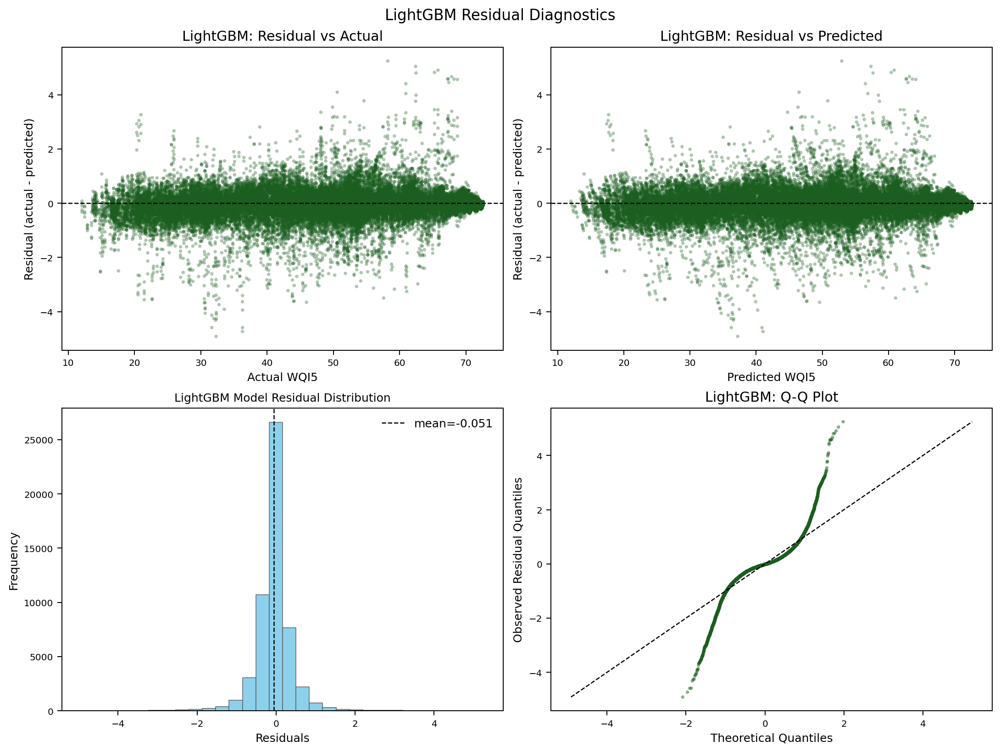

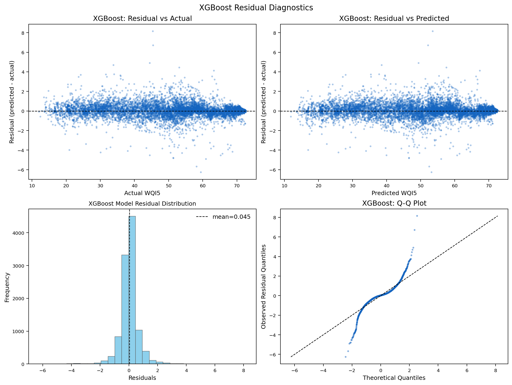

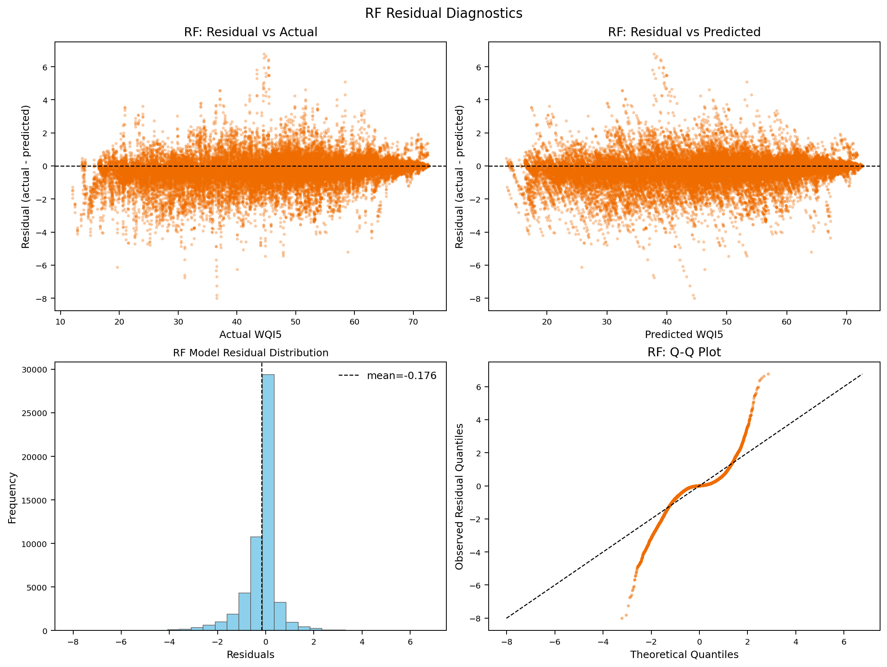

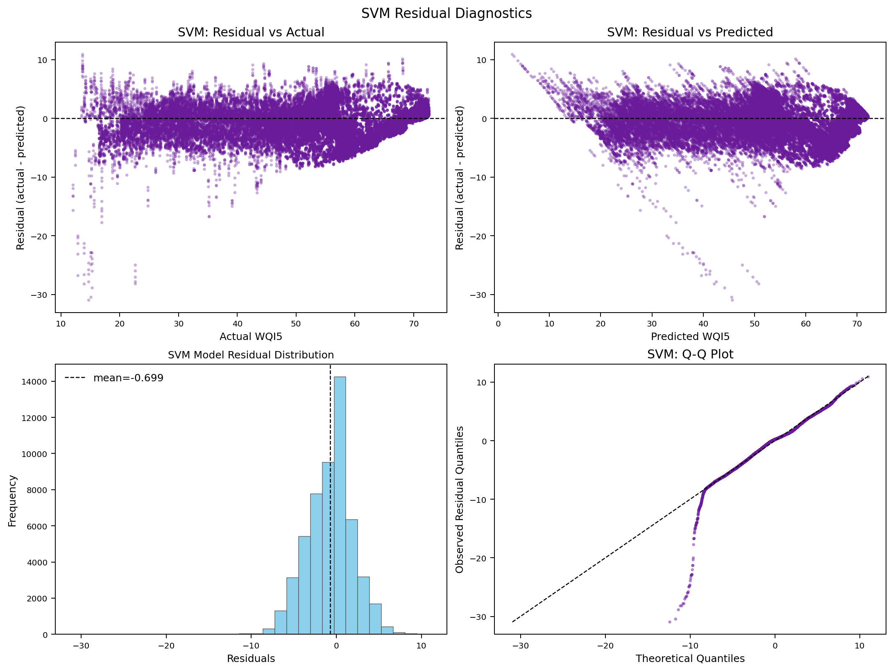

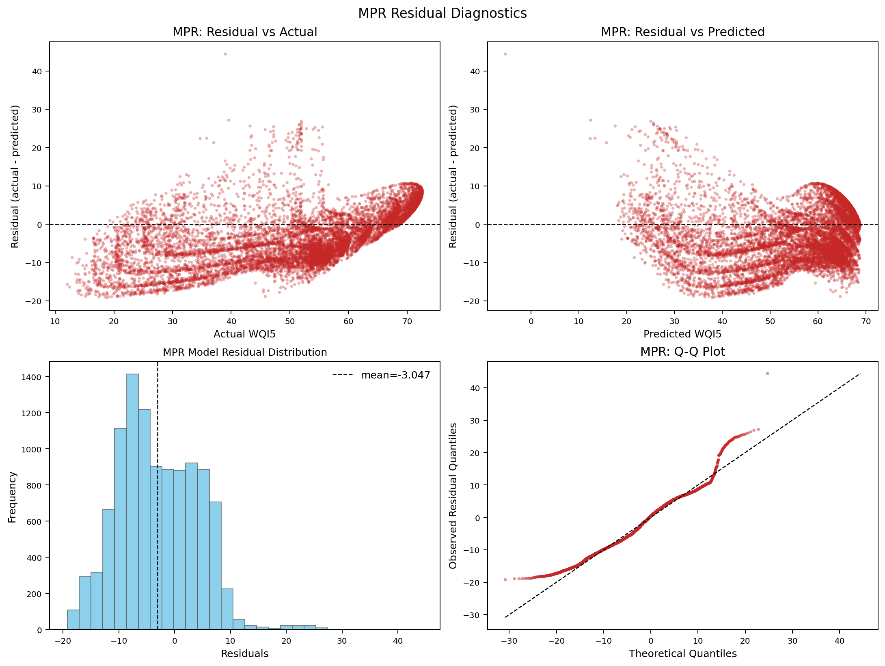

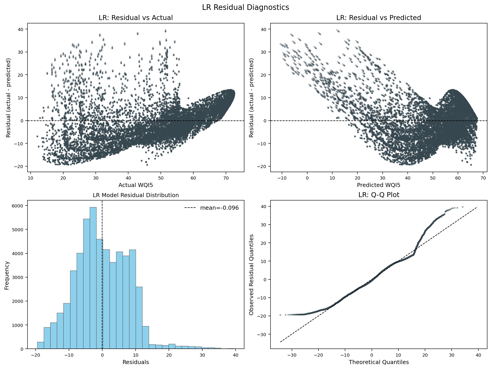

### Residual Histograms

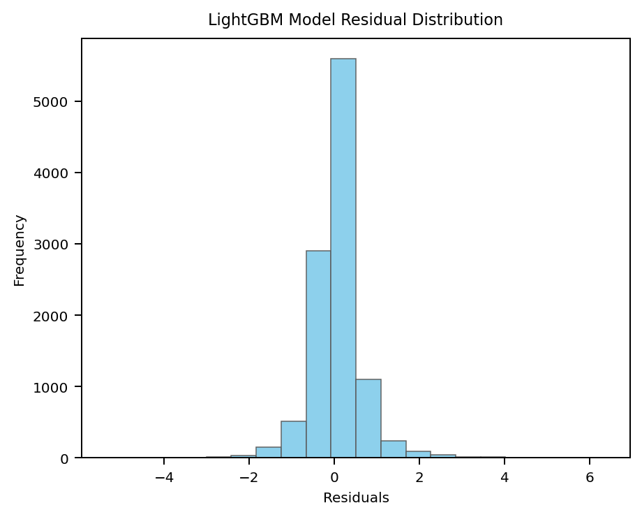

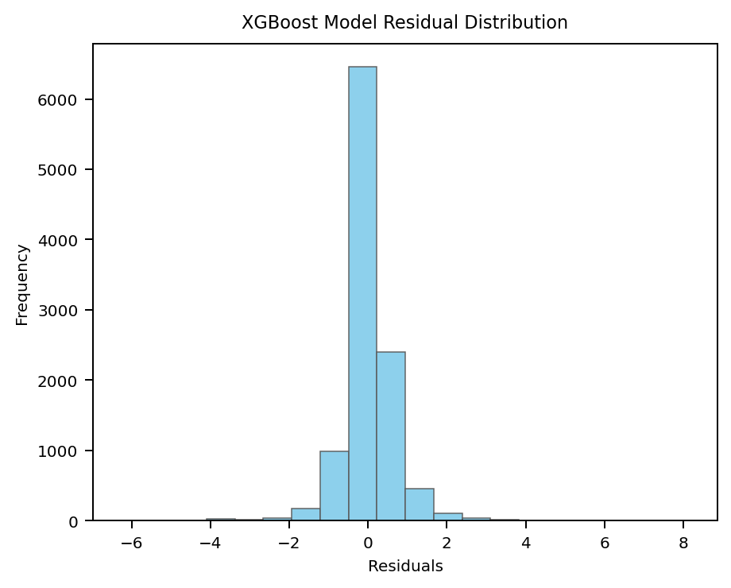

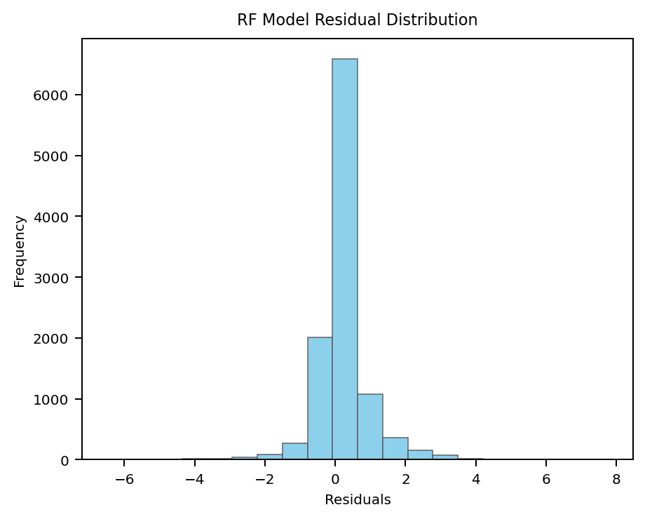

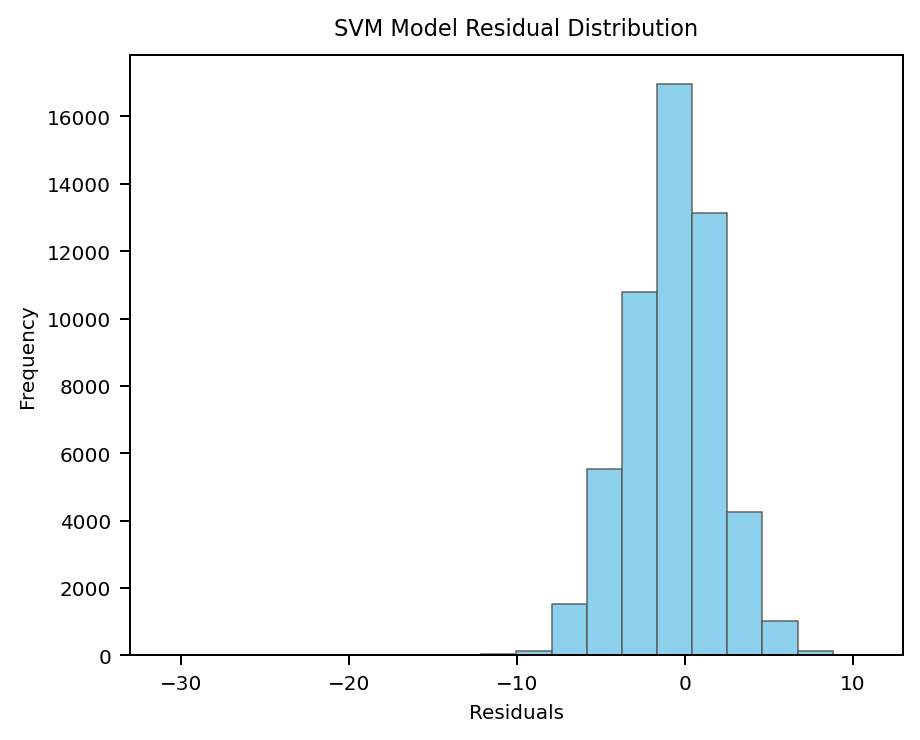

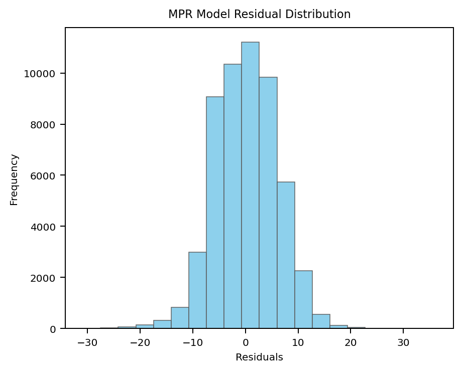

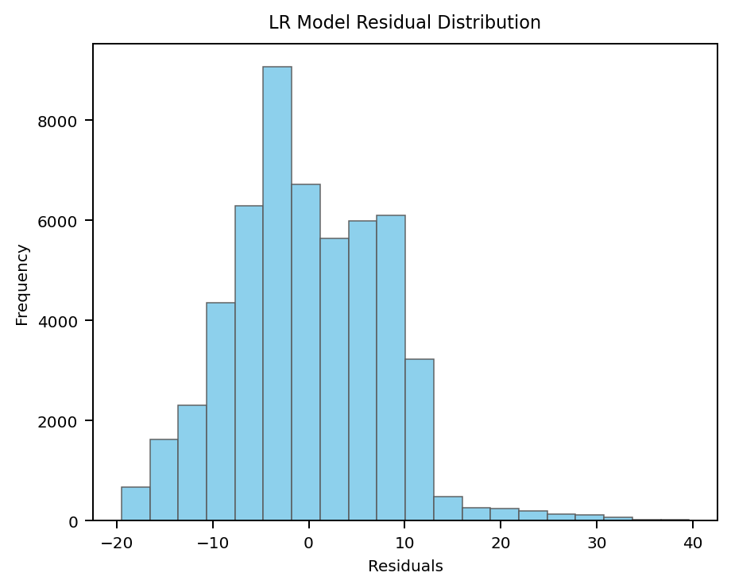

## Error by WQI Band

WQI bands follow the backend category configuration used by the WaterMirror API: Excellent, Good, Fair, Poor, Bad, and Terrible. The rows below summarize regression error within each actual WQI band. The 10,714-record hold-out set contains no Excellent rows.

| Actual WQI band | Lowest-MAE model | n | MAE | RMSE | Bias | MPA (%) |
| --- | --- | --- | --- | --- | --- | --- |
| Good | RF | 1535 | 0.0675 | 0.2694 | 0.0231 | 99.9053 |
| Fair | RF | 5463 | 0.2876 | 0.5377 | -0.0602 | 99.4957 |
| Poor | XGBoost | 2515 | 0.5840 | 0.8281 | -0.1048 | 98.5410 |
| Bad | XGBoost | 1180 | 0.4612 | 0.6485 | -0.0916 | 98.0267 |
| Terrible | XGBoost | 21 | 0.5395 | 0.7545 | -0.3157 | 96.1731 |

## Generated Files

- `metric_ci_by_runs.csv`
- `paired_tests_by_runs.csv`
- `test_prediction_metrics.csv`
- `test_bootstrap_ci.csv`
- `test_paired_error_tests.csv`
- `residual_diagnostics.csv`
- `error_by_wqi_band.csv`
- `dataset_distribution_robustness.csv`
- `sample_size_stability.csv`
- `figures/residual_overview.png`
- `figures/residual_qq_overview.png`
- `figures/residual_<model>.png`
- `figures/residual_diagnostics_<model>.png`
